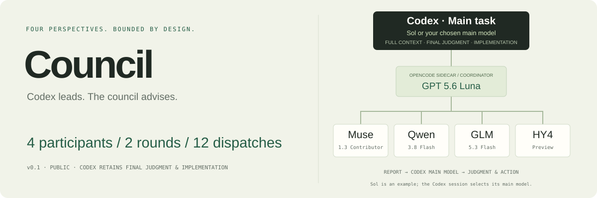

# OpenCode Council

**给 Codex 一组有边界的第二意见。四方讨论，主任务做最终判断。**

[工作方式](#工作方式) · [模型与参数](#模型与参数) · [验证结果](#验证结果) · [开始使用](#开始使用) · [独立展示页](#展示页) · [致谢与贡献者](#致谢与贡献者)

`v0.1` · 公开源码 · Linux 本机验收 · MIT · npm 尚未发布

Council 将简短任务交给 OpenCode sidecar：四位中立、只读的 participant 独立分析，再对彼此的结果进行交叉评阅。GPT 5.6 Luna 只负责调度与校验；当前 Codex 保留完整上下文、最终判断和后续编码权。

**主任务大模型 → 有界顾问讨论 → 主任务大模型判断与实施。** Codex 主会话可以使用 Sol 等大模型；Sol 是示例，不是插件固定指定的模型。Codex 主模型与 OpenCode sidecar 独立配置，Council 不会将主模型替换为 Luna，也不会把它计入 participant。

只在你明确说“开个 council”“quick council”“critical council”或使用 `$codex-council` 时调用，不自动接管任务。

## 工作方式

1. **独立分析**：第一轮向四方并发发送相同任务，不提前共享答案。
2. **交叉评阅**：后续轮次复用原子会话，由运行时注入其他三方上一轮的已验证原文。
3. **回到主任务**：输出发现、共识、分歧、风险、反证测试、未决问题六节报告，由 Codex 审视后做判断。

`/council` 与 `/debate` 是等价入口。没有无限扩展、自动增加模型或“多数即正确”的规则。

## 模型与参数

| 职责 | 当前模型 |
|---|---|
| Codex 主任务（sidecar 之外） | 当前会话主模型，例如 Sol；保留最终判断与编码权 |
| Coordinator | `opencode-go/gpt-5.6-luna` |
| Participant 1 | `opencode-go/muse-spark-1.3-contributor` |
| Participant 2 | `opencode-go/qwen3.8-flash` |
| Participant 3 | `opencode-go/glm-5.3-flash` |
| Participant 4 | `opencode-go/hy4-preview` |

| 模式 | 轮次 | 正常 dispatch | 剩余故障预算 | 整次调用时限 |
|---|---:|---:|---:|---:|
| quick | 1 | 4 | 8 | 300 秒 |
| 默认 | 2 | 8 | 4 | 600 秒 |
| critical | 3 | 12 | 0 | 900 秒 |

```text
/council --rounds 1 快速检查这个设计假设
/council --rounds 2 比较两种架构的风险
/council --rounds 3 交叉评阅这项关键变更
```

每位 participant 最多 **5 steps**；每人每轮最多 **2 次格式纠错**；所有正常调用、重试与纠错共享 **12 次 participant dispatch**。每个 canonical turn 最多 **8,000 个 Unicode 码点，包含截断标记**。

纠错次数是上限，不是保证可用的独立额度。四人 critical 的正常调用已用满 12 次预算；任何重试或纠错都会占用完成后续轮次所需的额度。runner 的总时限可通过 `CODEX_COUNCIL_TIMEOUT_SECONDS` 显式覆盖；默认轮询间隔为 1 秒。未提供 `--temperature`、`--top-p` 或 `--set` 参数。

## 运行时安全边界

- Participant 仅允许 read、grep、glob、lsp；禁止 bash、联网、编辑、task、skill、question、外部目录和读取 `.env`。
- Formatter 按 participant/round 读取实际任务结果，不接受 coordinator 用自己的 JSON 替换。格式错误返回原 participant。
- 下一轮必须等待上一轮全部 participant 结果都通过校验（默认四份）。peer 内容来自 canonical 原文，不由 coordinator 摘写。
- 预算、配置快照、子会话 ID、校验 hash 和终止状态跨进程保存。最多 8 次经过状态检查的 coordinator continuation；重启不清零、不退还未确认调用的预算。
- 仅确认旧进程已退出后才允许接管租约。状态缺失、损坏或不完整时拒绝继续。
- 成功须有全部配置轮次的 canonical turn 与完整六节 `## Council Report`。安全失败返回 `## Council Abort`、非零退出，不把失败伪装成成功。

安全账本默认位于 `${XDG_STATE_HOME:-~/.local/state}/opencode-council`，不保存 Brief 或讨论正文。sidecar 不在项目内持久化讨论 transcript；但 **OpenCode 自身仍保留 session，模型服务也有独立数据政策**。“本地 sidecar”不等于“本地模型”。

当前租约实现使用 Linux `/proc`，runner 使用 GNU `timeout`；其他操作系统尚未验收。Muse Contributor 需要账户持有者显式同意模型数据使用条款，安装器不会代替用户同意。

## 验证结果

### 当前默认四人配置

- **214 项 Node + 67 项 Python + 9 项 Skill 解析测试**及 runner mock、生成物、类型与包检查通过。
- Muse / Qwen / GLM / HY4 真实两轮验证通过：**8 次正常 dispatch、306 秒、零纠错与重试**。
- 已检查四个实际模型、两轮并发、原子会话复用，以及每人收到另外三方的精确 canonical 内容。
- 四人 1/2/3 轮的 4/8/12 次调用和超预算中止由本地测试覆盖；本次未进行四人一轮、三轮的额外真实调用。
- 旧三人配置和运行快照仍兼容；新建运行默认四人。HY4 是用户主动启用的 Preview 模型，不作与其他模型稳定性相同的承诺。

### 三人历史参考

以下保留的是 **2026-09-04 先前三 participant 配置的本机验收快照，不是四人配置验收**。其中的测试数量、dispatch 与耗时不代表当前四人配置已通过验收。

- **206 项 Node + 67 项 Python + 9 项 Skill 解析测试**全部通过，无跳过。
- runner mock、生成物一致性、TypeScript typecheck、package 检查均通过。
- 崩溃恢复、活进程租约、跨进程预算竞争、纠错上限、报告绑定与安全中止由 mock 和真实本地子进程测试覆盖。

| 历史三人真实模型场景 | 轮次 | Dispatch | 耗时 |
|---|---:|---:|---:|
| Quick | 1 | 3 | 34 秒 |
| 架构选择 | 2 | 6 | 64 秒 |
| 需求歧义 | 2 | 6 | 116 秒 |
| Critical | 3 | 9 | 190 秒 |

历史三人验收已检查实际模型、并发、第一轮输入一致性、子会话复用及 peer 内容一致性。四次成功调用均未触发跨进程 continuation，后者由当时的专项测试验证。

这些是简短 Brief 的单次验收，**不是性能或模型质量基准**。一次更完整的两轮代码评阅耗时 425 秒；长任务和外部服务故障仍可能触发时限或安全中止。

## 开始使用

### 1. 准备 checkout 与环境

源码可公开克隆；运行需要项目级 **Node 24.15.0**、Python 3，以及已配置 OpenCode Go 的 OpenCode。本机验收版本为 OpenCode 1.18.25；不修改主机默认 Node。

```bash
git clone --branch feature/council https://github.com/aka-debug-jie/opencode-council.git
cd opencode-council
npm ci
sh scripts/verify.sh
```

如果 checkout 已有 `.tools/node-v24.15.0-linux-x64`，verify 会使用它，并让 Python 子进程继承相同 Node 环境。verify 运行完整 Node/Python 回归、Skill 测试、生成物、类型与包检查，**不会调用付费模型**。

### 2. 安装 Skill 和检查配置

```bash
python3 scripts/install-council-skill.py
python3 scripts/install-council-skill.py --check
node scripts/sync-council-config.ts --check
```

安装器只同步受管 Skill 文件，保留未知文件和其他配置，不安装 Node、不配置 provider、不改凭据或 MCP。默认 runner checkout 是本机部署路径；在其他安装位置设置 `COUNCIL_CHECKOUT` 与 `COUNCIL_NODE`。

用户级模型配置位于 `${XDG_CONFIG_HOME:-~/.config}/opencode/opencode-council/config.yaml`。插件启动不会覆盖已有配置。确认差异后，可显式执行：

```bash
node scripts/sync-council-config.ts --apply
```

此操作只同步 Council 模型 registry，并保留原文件备份。部署机器应先运行 `opencode models --refresh` 核对可用模型。

### 3. 安装全局本地入口

在 `~/.config/opencode/plugins/opencode-council.ts` 中引用 checkout（使用真实绝对路径）：

```ts
export { server as OpenCodeCouncilPlugin } from "/absolute/path/opencode-council/index.ts"
```

已有本机部署不需要重复安装。运行时会对同进程、同项目的全局入口和项目入口去重。

随后在 Codex 中明确调用 `$codex-council`；也可以直接运行：

```bash
printf '%s' 'Decision: 比较两种设计。Context: ... Constraints: ...' |
  ~/.codex/skills/codex-council/scripts/run_council.sh --project-dir "$PWD" --rounds 2
```

### 发布与回滚

私有 npm 包 `@aka-debug-jie/opencode-council@0.1.0` **尚未发布**。发布后才可使用固定版本配置：

```json
{ "plugin": ["@aka-debug-jie/opencode-council@0.1.0"] }
```

回滚到上游的单行配置为 `{ "plugin": ["opencode-debate@2.2.2"] }`。如使用全局本地 wrapper，先禁用该 wrapper，避免两套插件同时加载。

## 展示页

独立展示页源码：[site/index.html](site/index.html)。无需构建、无外部字体/CDN/统计脚本。

```bash
python3 -m http.server 8080 --bind 127.0.0.1 --directory site
```

浏览器打开 `http://127.0.0.1:8080`。支持桌面与手机布局、键盘模式切换和命令复制。静态页面不是在线模型服务；本仓库没有自动公开网站的部署配置。

## 来源与许可

基于 [DrTralala/opencode-debate v2.2.2](https://github.com/DrTralala/opencode-debate/tree/v2.2.2) 定制，保留原作者归属与 [MIT 许可](LICENSE)。保留上游 remote 与基线 tag，不覆盖基线分支。旧 transcript 工具作为独立兼容模块继续测试；`docs/` 下的讨论内容不纳入版本控制。

## 致谢与贡献者

特别感谢 **[DrTralala](https://github.com/DrTralala)** 创建并以 MIT 许可开放 [opencode-debate](https://github.com/DrTralala/opencode-debate)。原项目的多模型讨论、participant 编排与结构化响应处理，为 OpenCode Council 提供了基础。我们在此之上定制了 Codex sidecar、有界运行状态和顾问报告工作流，并尊重、保留上游的作者与许可归属。

| 贡献者 | 贡献与角色 |
|---|---|
| [DrTralala / Trevor Leong](https://github.com/DrTralala) | 上游原作者；通过 `opencode-debate v2.2.2` 为本项目提供原始实现与设计基础 |
| [aka-debug-jie](https://github.com/aka-debug-jie) | `opencode-council` fork 维护者；负责定制、集成与维护 |

Thank you, DrTralala, for building and sharing the foundation this project builds on.

完整归属见 [CONTRIBUTORS.md](CONTRIBUTORS.md)。列入上游贡献者是对来源工作的致谢，不表示对方参与本 fork 的维护或为其背书。
